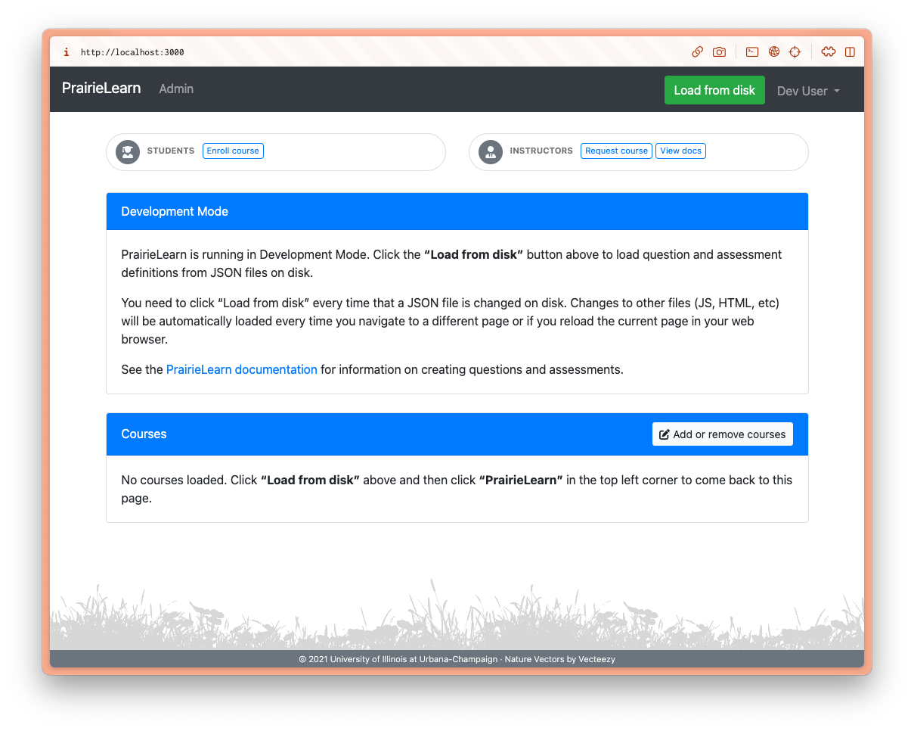
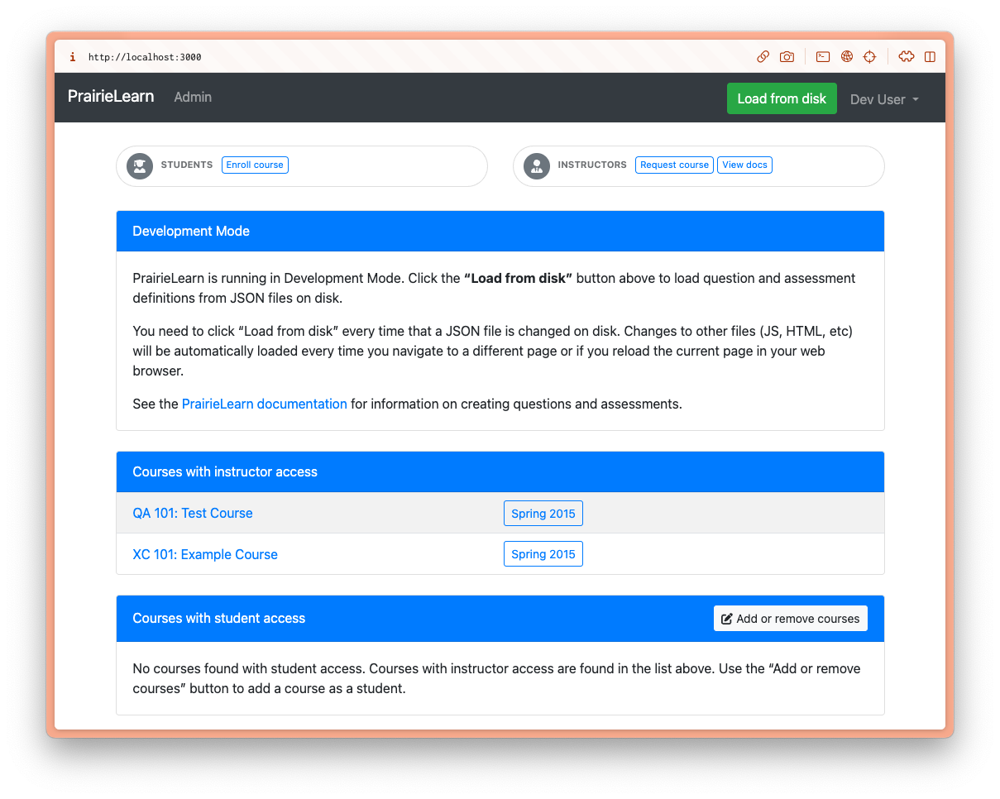
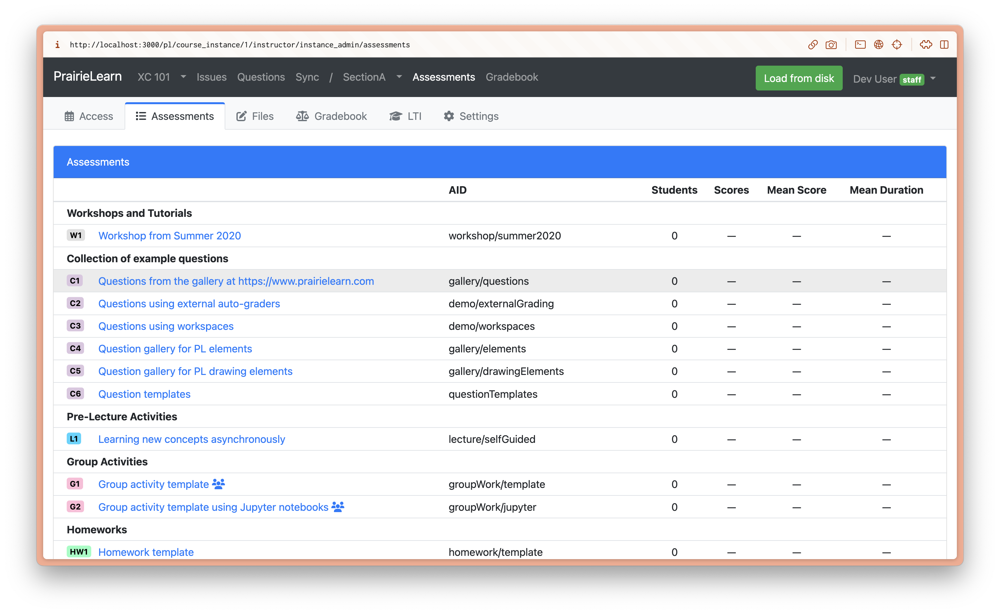
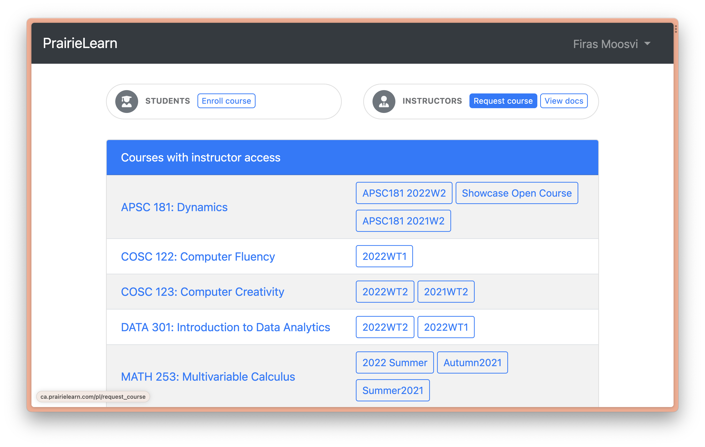

# PrairieLearn Course Development on Docker

This page describes the procedure to install and run your course locally within Docker. You can develop course content locally following the instructions below, or using the in-browser tools.

## Step 1: Download and Install Docker Desktop.

It's free but you will need at least 25 GB of free space on your machine.

- On macOS [download it here](https://docs.docker.com/desktop/install/mac-install/)
    - Make sure to download the correct version - if you have a M1 or M2 Mac, you want the Apple Silicon, otherwise older Macs will have an Intel Chip.
- On Windows [download it here](https://docs.docker.com/desktop/install/windows-install/)
    - There are some specific Windows version requirements, be sure to read the requirements carefully and ensure you meet either the WSL 2 backend or the Hyper-V backend
- On Linux and [download it here](https://docs.docker.com/desktop/install/linux-install/).
To confirm Docker is working, open a Terminal and run the following:

```
docker --version
```

You should get an output similar to:

```
Docker version y.y.y, build yyyyy
```

## Step 2: Pull the PrairieLearn Docker container

Open a Terminal, and run the following to pull the PrairieLearn image:

```
docker pull prairielearn/prairielearn
```

On an M1/M2 Mac, you will probably get an error like,

> no matching manifest for linux/arm64/v8 in the manifest list entries

If so, set the platform to `linux/x86_64` (because there isn't an M1/M2 image yet) like this:

```
docker pull --platform linux/x86_64 prairielearn/prairielearn
```

It will take a few minutes to download (depending on your internet connection).

## Step 3: Run PrairieLearn using the example course

To Launch PrairieLearn locally, run the following command:

```
docker run -it --rm -p 3000:3000 prairielearn/prairielearn
```

Your Terminal will be occupied and while it's launching, the message in the Terminal will say "Starting PrairieLearn...".
Once it's launched, a message will print in the Terminal that says:

> info: Go to http://localhost:3000" ; 

visit that webpage in a new browser.
Your Terminal will still be occupied and you should keep it running.
To interrupt and stop the container, press `Ctrl + C` in the Terminal (you may have to do this several times).

In a browser, here's what you should see:



## Step 4: Load the Example Course

Every time you launch a PrairieLearn Docker container, you will need to load the list of courses.
By default, the PrairieLearn Docker image contains a directory named [`exampleCourse`](https://github.com/PrairieLearn/PrairieLearn/tree/master/exampleCourse).
First, click on "Load from disk" above and then click "PrairieLearn" in the top left corner to come back to this page.

Once you return to the PrairieLearn home page, here is what you should see:



## Step 5: Explore the Example Course

The example course contains many question and assessment types for you to explore.
You can experience the questions within Assessments (as students would see it), or browse questions from the Question Bank individually using tags and topics.

Here is what the Assessments will look like.



For more details about the example course and how to author your own questions, [see this section here](https://prairielearn.readthedocs.io/en/latest/getStarted/).

Once you're done exploring, stop the Docker Container (using Ctrl+C in the Terminal)

## Step 6: Fork the IND 100 sample PrairieLearn course

If you haven't already done this, follow the [steps outlined here](opb_course_repo).

<!-- 
## Step 6: Request your own course on PrairieLearn

Once you're ready to develop questions for your own course, you should first request a course through the appropriate PrairieLearn instance:



Once you have a PrairieLearn course, you should clone it locally, and then add it to your local Docker container (see next step).
 -->

## Step 7: Add your own course to the local PrairieLearn instance

To use your own course, bind the Docker `/course` directory with your own course repo directory using the `-v` flag.
In the command below, replace `local_path` with the path to where your course repo is cloned locally:

```
docker run -it --rm -p 3000:3000 -v local_path:/course prairielearn/prairielearn
```

```{tip}
For staff working on the Open Problem Bank, your `local_path` should be the absolute path wherever you cloned the IND 100 (`pl-opb-ind100`) and the `instructor_physics_bank` repositories.
```

```{tip}
If you are using Docker for Windows then you will need to first give Docker permission to access the `C:` drive (or whichever drive your course directory is cloned in).
This can be done by right-clicking on the Docker "whale" icon in the taskbar, choosing "Settings", and granting shared access to the `C:` drive.
```

To use multiple courses, add additional `-v` flags (e.g., -v /path/to/course:/course -v /path/to/course2:course2). There are nine available mount points in the Docker: `/course`, `/course2`, `/course3`, ..., `/course9`.

If you're in the root of your course directory already, you can substitute `%cd%` (on Windows) or `$PWD` (Linux and MacOS) for `/path/to/course`.

<!-- 
If you plan on running externally graded questions in local development, please see [this section](https://prairielearn.readthedocs.io/en/latest/externalGrading/#running-locally-on-docker) for a slightly different docker launch command.

**NOTE**: On MacOS with "Apple Silicon" (ARM64) hardware, the use of R is not currently supported.
 -->

## Step 8: Install the OPB conversion script


## Step 9: Test that questions created within the `instructor_physics_bank` are sent to IND 100

```{warning}
Before you attempt this step, you need to first 

Open a Terminal, and navigate to a `