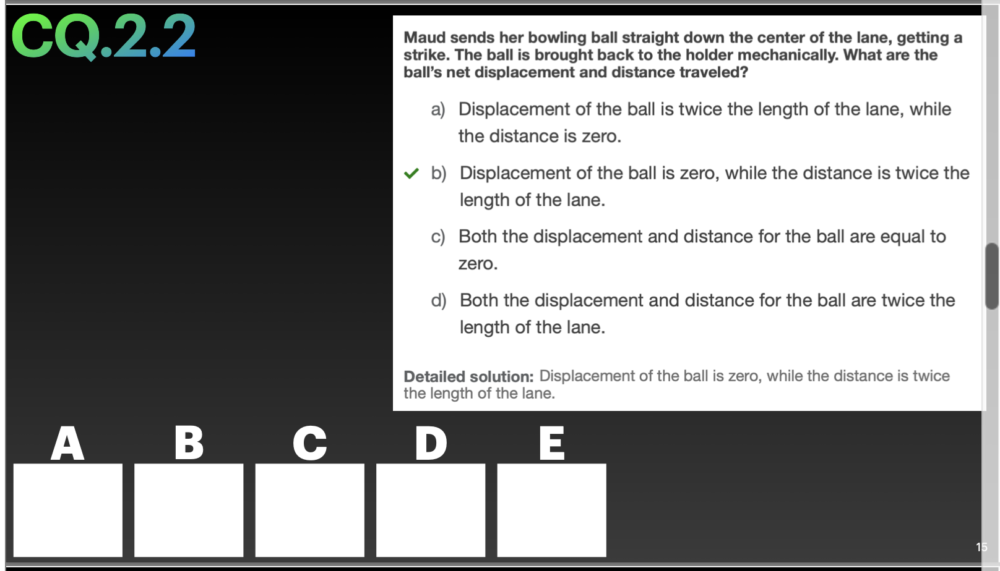
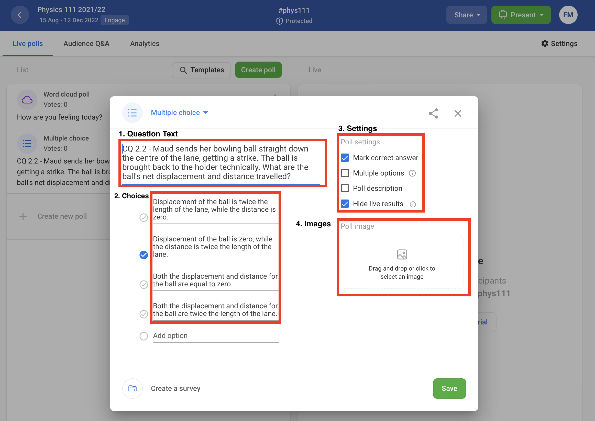

# Slido

Sli.do is an online polling service that is convenient and easy to use for the students, with no requirements for accounts or special hardware.
Student simply scan the QR code each class to get taken to the question page, or type in the event code (usually the name of the course, e.g., PHYS111).
This is a low-barrier way to get student participation in class questions without worrying about tracking individual students and enforcing attendance or correctness.

Unfortunately, this makes it somewhat more difficult on the teaching team because the questions on the slides usually need to be added to Sli.do so students see the clicker questions in the correct order.

## Task: Add clicker questions to Slido

Imagine starting with this clicker question (from one of my slides).

To convert it into a Slido poll question, copy the question text, and the answer choices into a new "Multiple Choice" question, and then select the correct answer.
Below is a screenshot of the Slido interface to accomplish all of the above:

Once the question is added as a poll, then the instructor can use it in class like so:

I will typically assign one TA to do all the questions for the whole term (if they're ready), or assign multiple TAs several weeks in a term and they're responsible for getting the questions up on Slido before class starts.
If I don't have my lecture content ready in time (very likely), I will likely just do that week's slido question myself in a last minute scramble/panic.
Note that depending on how the class goes, not all questions will be presented to students live - some will be assigned as extra practice questions for home.

## Task: Managing Slido during class

Here's the typical way I will use Sli.do in class, on one side is the Slido screen where questions are displayed, and on the other side are the day's slides.

I will typically assign a TA to handle the opening and closing of poll questions from the room PC.
Typical tasks are:

- Displaying the question for students to answer
- Revealing the stats for how students answered
- Revealing the answer
- Skipping a question
- Resetting a question and re-displaying the question for students to answer
- Creating a new question "on the fly"

